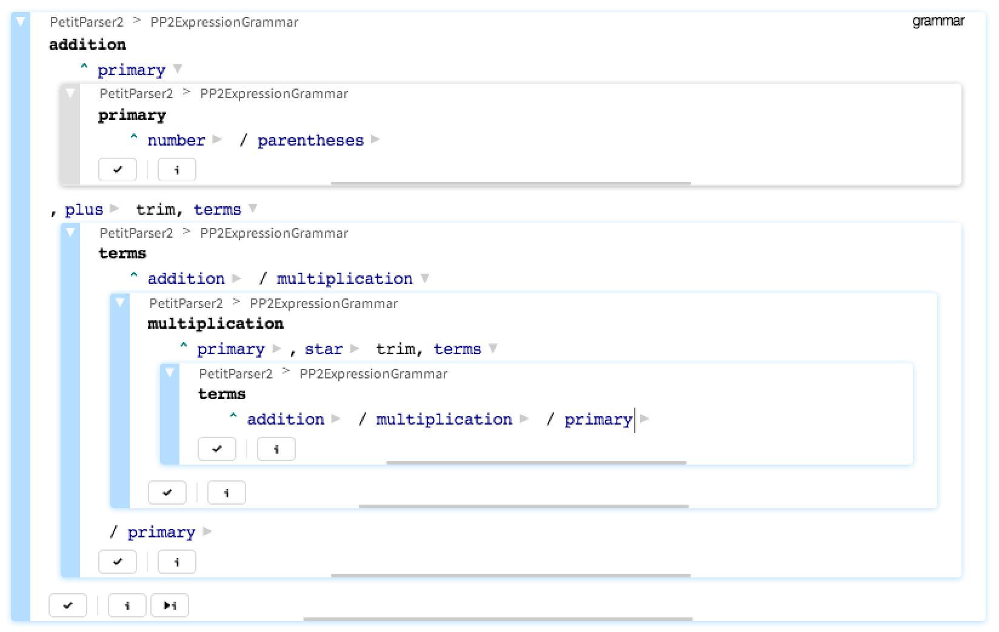

# GT for PetitParser2
The development environment for PetitParser2 based on the [Glamorous Toolkit](https://gtoolkit.com).

## How to load

The ideal way to load the code is by loading the entire [Glamorous Toolkit project](https://github.com/feenkcom/gtoolkit).

